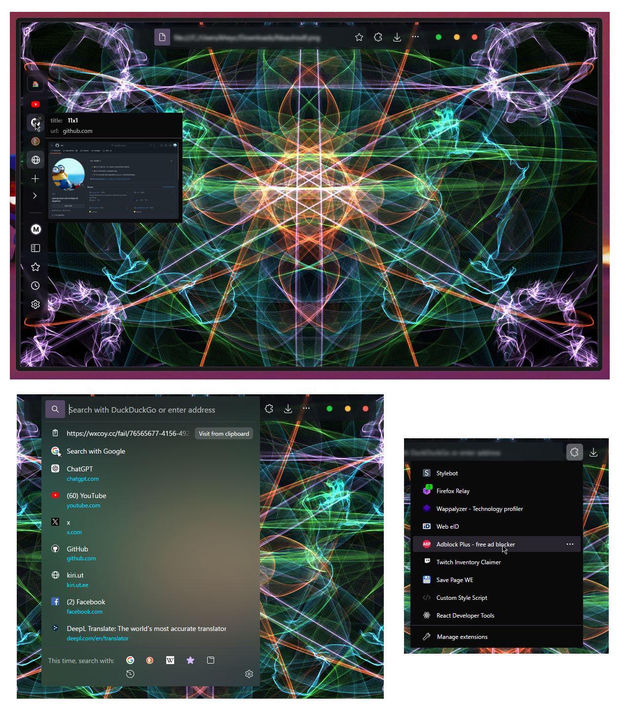

# zen-franzen-theme
Sleek and minimalistic theme for zen (preview below).  
  
# How to install
Download the repo and move `franzen-theme` folder to `chrome` folder in your Zen profile. Add these lines to your `chrome/userChrome.css`:
```css
@import "franzen-theme/titlebar.css";
@import "franzen-theme/sidebar.css";
@import "franzen-theme/urlbox.css";
@import "franzen-theme/sidebarwindowclose.css";
@import "franzen-theme/statuspanel.css";
@import "franzen-theme/popups.css";
@import "franzen-theme/webview.css";

/* ... */
```
  

